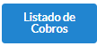
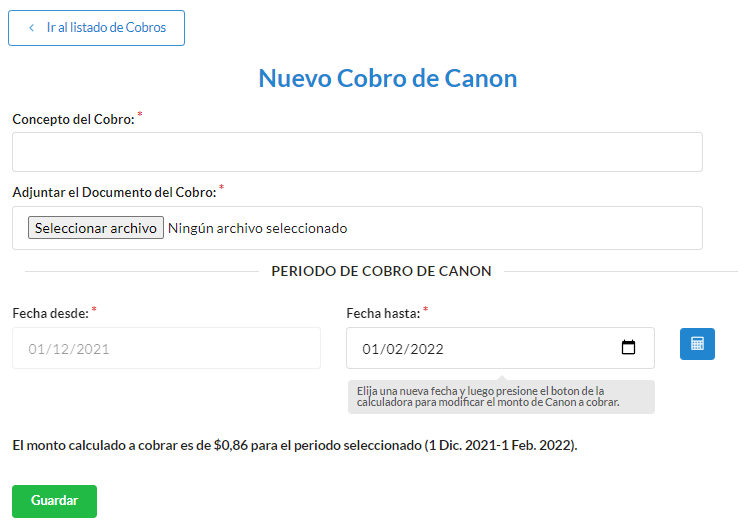
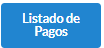
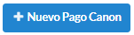
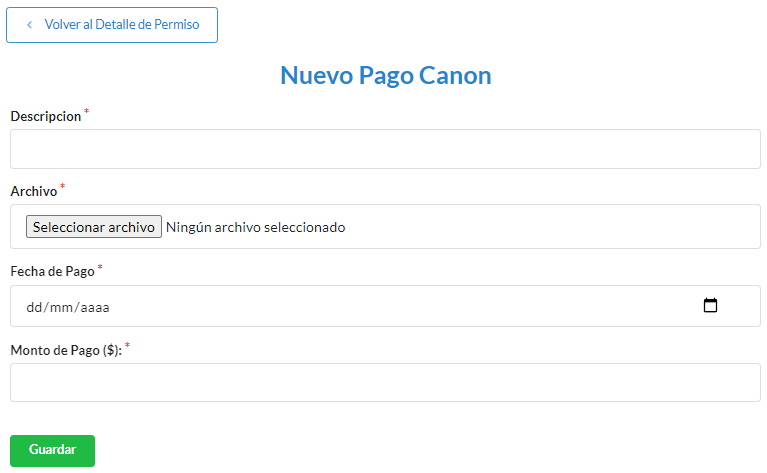

=============
Canon Permiso
=============

**********************************
Cómo crear un nuevo cobro de Canon
**********************************

Desde el listado de permisos seleccionamos el **Permiso** al cual le vamos a realizar el **Cobro de Canon**.

.. image::  _static/solicitud_listado.png
   :align:  center

Nos dirigimos al icono **Ispeccionar** el cual nos mostrara la información del mismo

.. image::  _static/acion_inspecion.png
   :align:  center

Nos dirijimos al boton de **Listado de Cobros**

Nos mostrata el listado de cobros que posee el permiso, para generar uno nuevo nos dirigimos a **Nuevo Cobro de Canon**.

Para terminar registrar el **Cobro de Canon**  debemos completar **Consepto del Cobro**, **Archivo**, **Fecha desde**, **Fecha Hasta**, el sistema ayuda a calcular el monto dentro de este periodo. Cuando este toda la informacion dirigirse al boton **Guardar** para terminar de registrar el cobro.

**********************************
Cómo crear un nuevo pago de Canon
**********************************

Desde el listado de permisos seleccionamos el **Permiso** al cual le vamos a realizar el **Pago de Canon**.

.. image::  _static/solicitud_listado.png
   :align:  center

Nos dirigimos al icono **Ispeccionar** el cual nos mostrara la información del mismo

.. image::  _static/acion_inspecion.png
   :align:  center

Nos dirijimos al boton de **Listado de Pagos**

Nos mostrata el listado de pagos que posee el permiso, para generar uno nuevo nos dirigimos a **Nuevo Pago de Canon**.

Para terminar registrar el **Pago de Canon**  debemos completar **Descripcion**, **Archivo**, **Fecha de Pago**, **Monto**.

