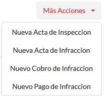
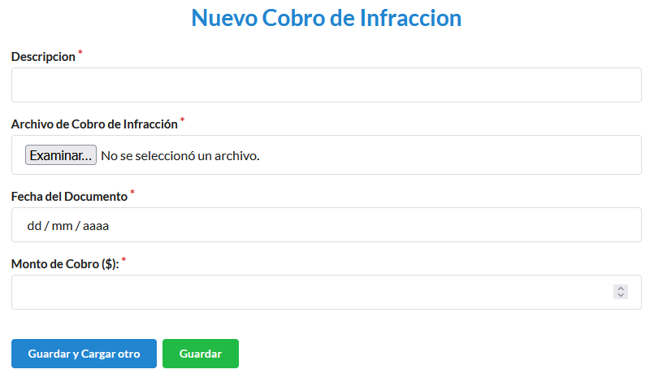
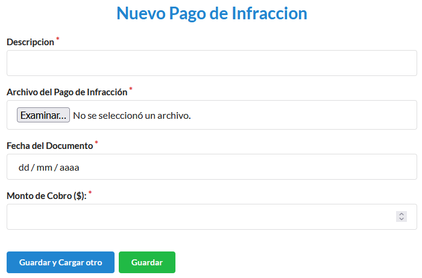

================
Canon Infracción
================

***************************************
Cómo crear un nuevo cobro de infracción
***************************************

Desde el listado de permisos seleccionamos el **Permiso** al cual le vamos a realizar el **Cobro de infracción**.

.. image::  _static/solicitud_listado.png
   :align:  center

Nos dirigimos al icono **Más Acciones** el cual nos despliega opciones, seleccionamos **Nuevo Cobro de Infracción**.

Para terminar registrar el **Cobro de infracción**  debemos completar **Descripción**, **Archivo**, **Fecha del documento**, **Monto del Cobro**.

***************************************
Cómo crear un nuevo pago de infracción
***************************************

Desde el listado de permisos seleccionamos el **Permiso** al cual le vamos a realizar el **Pago de infracción**.

.. image::  _static/solicitud_listado.png
   :align:  center

Nos dirigimos al icono **Más Acciones** el cual nos despliega opciones, seleccionamos **Nuevo Pago de Infracción**.

Para terminar registrar el **Pago de infracción**  debemos completar **Descripción**, **Archivo**, **Fecha del documento**, **Monto del Cobro**.

