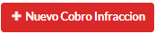
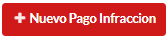

================
Canon Infracción
================

***************************************
Cómo crear un nuevo cobro de infracción
***************************************

Desde el listado de permisos seleccionamos el **Permiso** al cual le vamos a realizar el **Cobro de infracción**.

.. image::  _static/solicitud_listado.png
   :align:  center

Nos dirigimos al icono **Ispeccionar** el cual nos mostrara la información del mismo

.. image::  _static/acion_inspecion.png
   :align:  center

Nos dirijimos al boton de **Listado de Cobros**

.. image::  _static/listado_de_cobros.png
   :align:  center

Nos mostrata el listado de cobros que posee el permiso, para generar uno nuevo nos dirigimos a **Nuevo Cobro de Infracción**.

Para terminar registrar el **Cobro de infracción**  debemos completar **Descripción**, **Archivo**, **Fecha del documento**, **Monto del Cobro**.

.. image::  _static/cobro_infraccion.png
   :align:  center

***************************************
Cómo crear un nuevo pago de infracción
***************************************

Desde el listado de permisos seleccionamos el **Permiso** al cual le vamos a realizar el **Pago de infracción**.

.. image::  _static/solicitud_listado.png
   :align:  center

Nos dirigimos al icono **Ispeccionar** el cual nos mostrara la información del mismo

.. image::  _static/acion_inspecion.png
   :align:  center

Nos dirijimos al boton de **Listado de Pagos**

.. image::  _static/listado_de_pagos.png
   :align:  center

Nos mostrata el listado de pagos que posee el permiso, para generar uno nuevo nos dirigimos a **Nuevo Pago de Infracción**.

Para terminar registrar el **Pago de infracción**  debemos completar **Descripción**, **Archivo**, **Fecha del documento**, **Monto del Cobro**.

.. image::  _static/pago_infraccion.png
   :align:  center