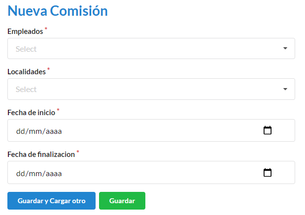
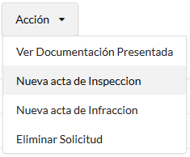

=========
Comisión
=========

*****************************
Cómo crear una nueva comisión
*****************************

Desde el panel principal, podremos ingresar a **Comisión**.

Para ingresar una nueva comisión, en la pantalla deberá completar los campos **Empleados** (para éste caso, aparecerá un desplegable con los empleados vigentes. Pueden tener mas de 1 empleado asignado), **Localidades** (para éste caso, aparecerá un desplegable con las localidades vigentes. Pueden tener más de 1 ciudad asignada), **Fecha de inicio**, **Fecha de finalización**. Los campos con * son obligatorios. Completados los campos se podrá **Guardar** o **Guardar y Cargar otro**.

***************************************
Cómo crear una nueva acta de inspección
***************************************

Las actas de inspección, son realizadas para cada permiso, en caso de que un establecimiento no este registrado, la comisión debe recaudar los datos necesarios para poder darlo de alta.

Buscamos la solicitud a la cual vamos a registrar la inspección, sobre el botón **Acción**. Nos dirigimos a **Nueva acta de inspección**

Para ingresar una nueva acta de inspección, en la pantalla deberá completar los campos **Descripción**, **Archivo**, **Fecha del documento**, **Comisión** (para éste caso, aparecerá un desplegable con las comisiones realizadas).

.. image::  _static/inspecion_acta.png
   :align:  center

*******************************
Cómo crear una nueva infracción 
*******************************

Las actas de infracción, son realizadas para cada permiso, en caso de que un establecimiento no este registrado, la comisión debe recaudar los datos necesarios para poder darlo de alta.

Buscamos la solicitud a la cual vamos a registrar la infracción, sobre el botón **Acción**. Nos dirigimos a **Nueva acta de infracción**

.. image::  _static/infraccion_accion.png
   :align:  center

Para ingresar una nueva acta de infracción, en la pantalla deberá completar los campos **Descripción**, **Archivo**, **Fecha del documento**, **Comisión** (para éste caso, aparecerá un desplegable con las comisiones realizadas).

.. image::  _static/infraccion_acta.png
   :align:  center