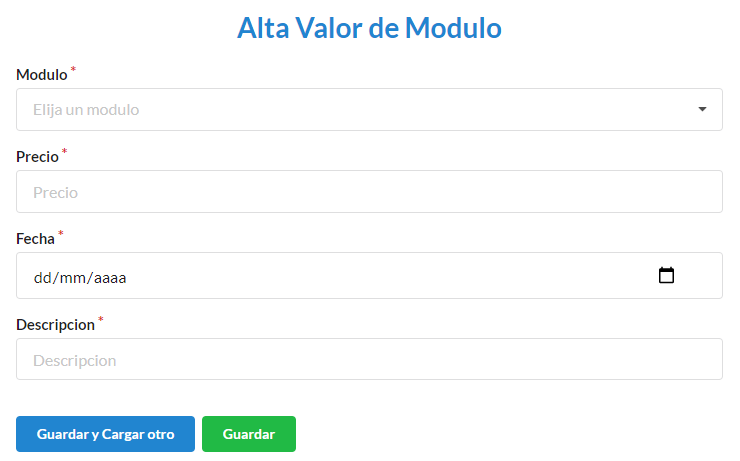

=========
Generales
=========

***********************************
Cómo crear un nuevo Valor de Módulo
***********************************

Desde el panel principal, podremos ingresar a **Valor Módulo**.

Luego buscamos el botón de **Nuevo Valor de Módulo**.

En el formulario deberá completar los campos **Módulo** (para éste caso, aparecerá un desplegable con los modulos vigentes), **Precio**, **Fecha**, **Descripción**. Los campos con * son obligatorios. Completados los campos se podrá **Guardar** o **Guardar y Cargar otro**.

