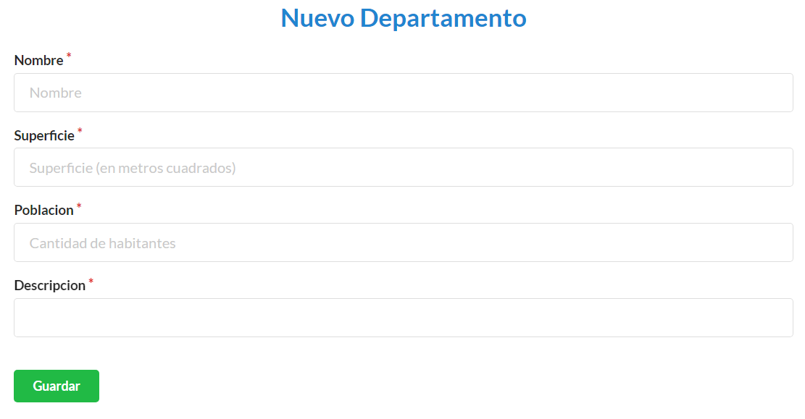
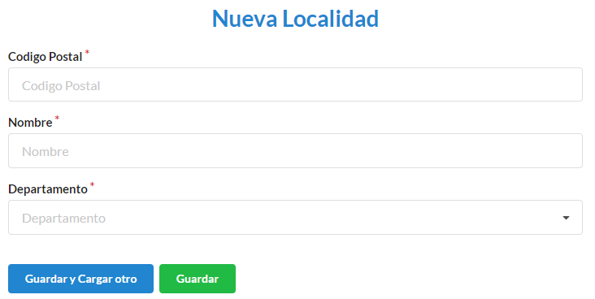
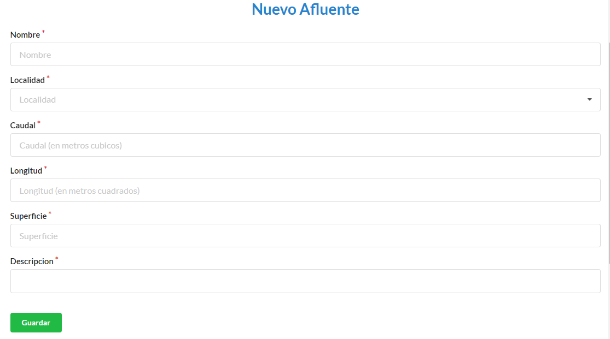

===========
Localidades
===========

*********************************
Cómo crear un nuevo departamento
*********************************

Desde el panel principal, podremos ingresar a la opción **Departamentos**.

Luego buscamos el botón de **Nuevo Departamento**.

En el formulario deberá completar los campos **Nombre**, **Superficie**, **Población**, **Descripción**. Los campos con * son obligatorios. Completados los campos se podrá **Guardar** o **Guardar y Cargar otro**.

*******************************
Cómo crear una nueva localidad
*******************************

Desde el panel principal, podremos ingresar a la opción **Localidades**.

Luego buscamos el botón de **Nueva Localidad**.

En el formulario deberá completar los campos **Código Postal**, **Nombre**, **Departamento** (para éste caso, aparecerá un desplegable con los departamentos vigentes). Los campos con * son obligatorios. Completados los campos se podrá **Guardar** o **Guardar y Cargar otro**.

*******************************
Cómo crear un nuevo afluente
*******************************

Desde el panel principal, podremos ingresar a la opción **Afluentes**.

Luego buscamos el botón de **Nuevo Afluente**.

En el formulario deberá completar los campos **Nombre**, **Localidad** (para éste caso, aparecerá un desplegable con las localidades vigentes), **Caudal** (campo en metros cúbicos), **Longitud** (campo en metros cuadrados), **Superficie**, y **Descripción** . Los campos con * son obligatorios. Completados los campos se podrá **Guardar** o **Guardar y Cargar otro**.

