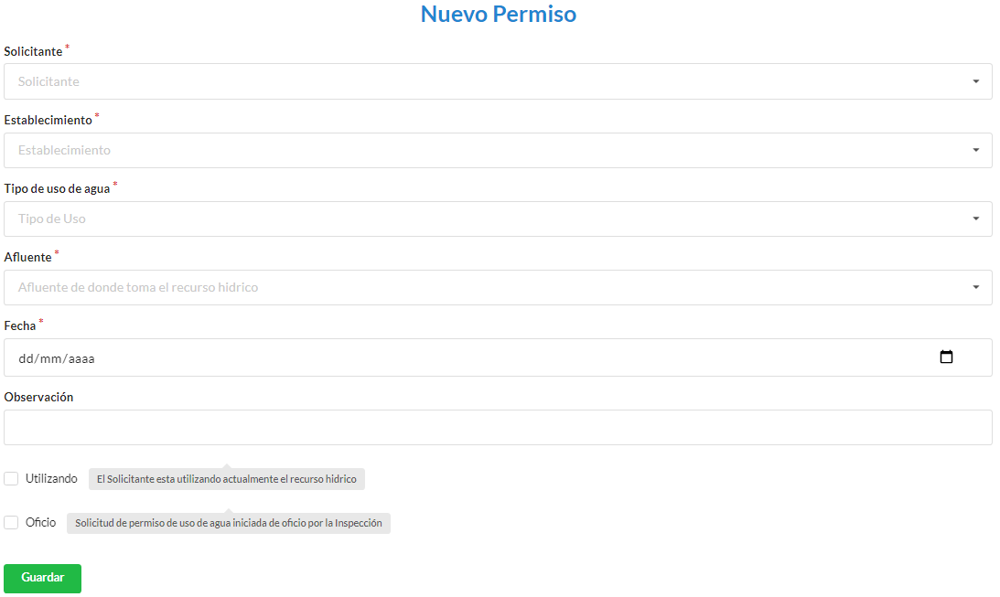

.. _cheat-sheet:

Permiso
=======

Cómo crear un nuevo permiso
===========================

**OBSERVACION: Para crear un nuevo permiso previo debe haber creado al menos un Solicitante, un Establecimiento, un Tipo de uso de agua, un Afluente.**

Desde el panel principal, podremos ingresar a la opción **Permisos**.

Luego buscamos el botón de **Nuevo permiso**.

.. image::  _static/panel_permiso_nuevo.png
   :align:  center

Para ingresar un nuevo permiso, en la pantalla deberá completar los campos **Solicitante**, **Establecimiento**, **Tipo de uso de agua** (para éste caso, aparecerá un desplegable con los tipos de uso de agua vigentes), **Afluente** (para éste caso, aparecerá un desplegable con los caudales vigentes), **Fecha**, **Observación**, **Utilizado** u **Oficio** (en caso de que se este utilizado el recurso, debe seleccionarse **Utilizado**, en caso de no estar siendo utilizado seleccionar **Oficio**). Los campos con * son obligatorios. Completados los campos se podrá **Guardar**.

