=========================
Cómo gestionar un permiso
=========================

Para poder continuar el proceso de aprobación de un permiso, desde el panel principal, podremos ingresar a la opción **Permisos**, donde visualizaremos el listado de permiso, localizamos el permiso.

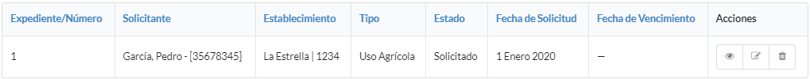

Nos dirigimos al icono inspeccionar, para ver en detalle el estado del permiso.

.. image::  _static/acion_inspecion.png
   :align:  center

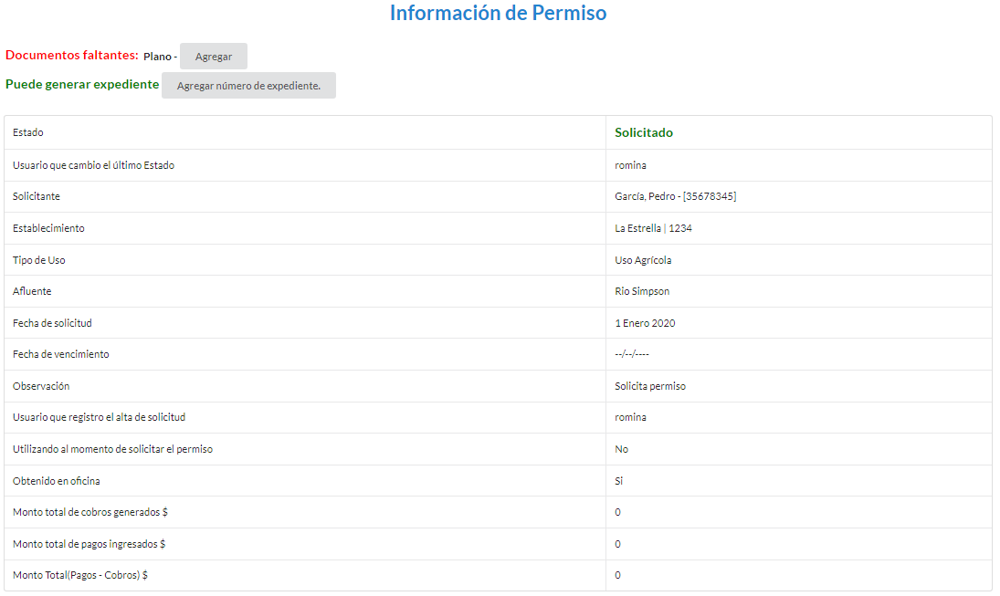

******************
Agregar Documentos
******************
Debemos completar toda la documentación faltante, que se especifica debajo de **Documentos faltantes:**, cuando contemos con alguna información faltante, debemos dirigirnos al botón **Agregar**.

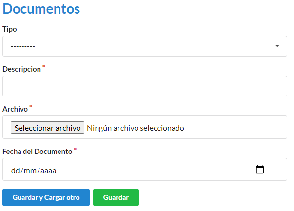

Para ingresar un documento, en la pantalla deberá completar los campos **Tipo** (para éste caso, aparecerá un desplegable con los documentos faltantes), **Descripción**, **Adjuntar el documento digital** (Se nos abrira un explorador de archivos, en el cual debemos ubicar el archivo del documento a subir), **Fecha de entrega del documento** (Se registrará la fecha en que fue entregada la documentación). Completados los campos se podrá **Guardar** o **Guardar y Cargar otro**.

Completada toda la documentación requerida, nos encontraremos con éste mensaje. El visado es el trámite legal donde se corrobora que el documento presentado sea el correcto.

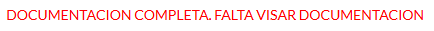

****************
Visar Documentos
****************

Para realizar el visado, debemos ir al botón de **Documentación**, y encontraremos el listado de los documentos presentados, con la descripción de el estado en que se encuentra cada uno.

**CAMBIAR IMAGEN**
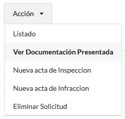

El botón de **Acción** nos presentará un desplegable con las opciones disponibles:

**Rechazar** en caso de que el documento presente algún error.
**Visar** en caso de que el documento sea correcto.
**Modificar** en caso de que se necesite hacer un rectificación sobre el documento en cuanto a los datos cargados.
**Eliminar** en caso de error en la carga.

.. image::  _static/solicitud_documento_accion.jpeg
   :align:  center

La acción de **Rechazar** es para cuando un documento no cumple con los requisitos o no sea válido. Ésta acción cambia el estado del permiso a **Revisado**

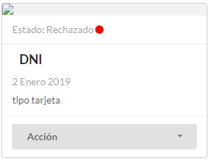

La accion de **Visar** es para cuando el documento es correcto. Esta accion puede cambiar el estado del permiso a **Visado**,

.. image::  _static/solicitud_documento_accion_vizar.jpeg
   :align:  center

La accion de **Modificar** nos abrira una nueva ventana, donde podremos modificar todos los datos. Esta accion no cambia el estado del permiso.

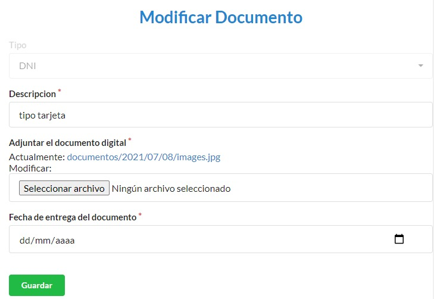

La accion de **Elminar** es para cuando se desear borrar el documento presentado, nos preguntara si estamos seguros de realizar esta accion. Esta accion no cambia el estado del permiso.

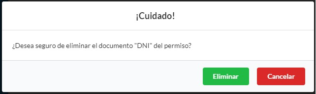

******************
Agregar Expediente
******************

Cuando la toda la documentacion esta cargada y visada, dentro del persmiso nos encontaremos con un cartel **DOCUMENTACION COMPLETA** y un boton que nos pedira que ingresemos el numero de expediente.

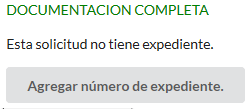

Para terminar de ingregar el numero de expediente, debemos completar **Descripcion**, **Archivo**, **Fecha del documento**, **Numero de expediente**

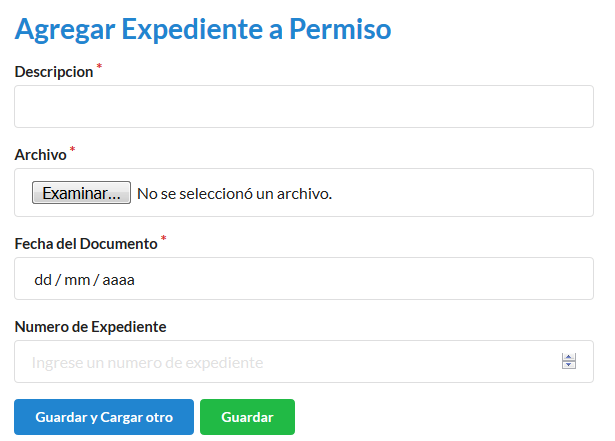

**************
Agregar Edicto
**************
Leugo de ingresado el expediente, se debe generar un edicto, el cual debe ser publicado dentro del boletin oficial y en al menos 1 diario local. 

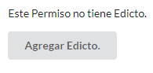

Debemos completar **Descripcion**, **Archivo**, **Fecha del documento**, **Tiempo de publicacion** (en dias)

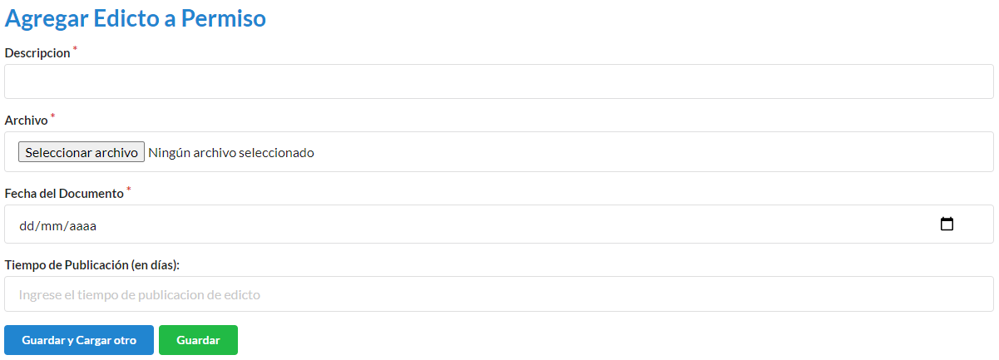

Mientras estemos dentro de los dias de publicacion, puede que lleguen oposiciones o en caso de que no existan se realiza la resolucion para otorgar el permiso. Tendremos la opcion de **Agregar Resolucion** o **Agregar Oposicion**

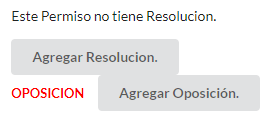

******************
Agregar Resolucion
******************

Debemos completar **Descripcion**, **Archivo**, **Fecha del documento**, **Unidades**, **Fecha del primer cobro** (nos aclara la fecha maxima del cobro), **Fecha de venciminto**.

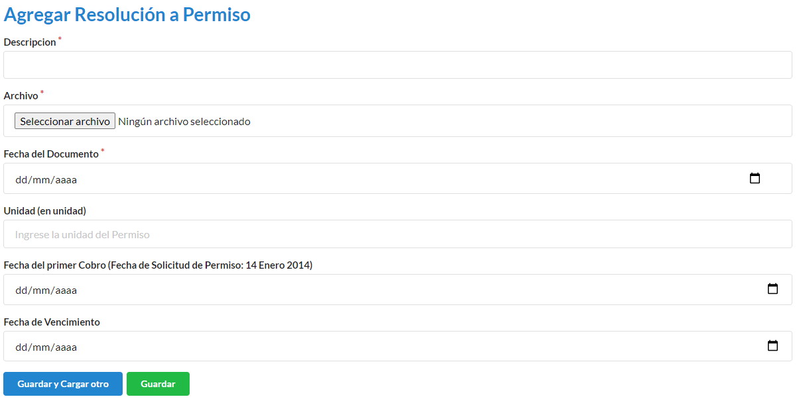

Luego de agregada la resolucion el **Permiso** se encuentra **Otorgado**

*****************
Agregar Oposicion 
*****************

Debemos completar **Descripcion**, **Archivo**, **Fecha del documento**.

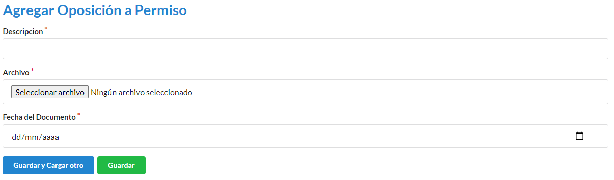

***********************************
Como crear un nuevo establecimiento
***********************************

Para ingresar un nuevo establecimiento, en la pantalla deberá dirigirse a **Establecimientos**

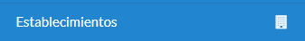

Luego nos dirigimos a **Nuevo Establecimiento**

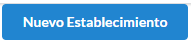

En el formulario debemos completar los campos **Dueño** (este debe ser el solicitante), **Codigo catastral**, **Superficie** (esta sera tomadas en m2), **Nombre** (nombre del establecimiento), **Descripción**. Los campos con * son obligatorios. Completados los campos se podra **Guardar** o **Guardar y Cargar otro**.

.. image::  _static/nuevo_establecimiento.png
   :align:  center

*******************************
Como crear un nuevo tipo de uso
*******************************
Para ingresar un nuevo tipo de uso debemos ir a **Tipo de Uso**

.. image::  _static/panel_tipodeuso.png
   :align:  center

Luego nos dirigimos a **Nuevo Tipo de Uso**

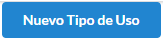

En el formulario debemos completar los campos **Descripción** (este sera el nombre del tipo de uso), **Coeficiente** (este puede ser un numero real), **Periodo** (para este caso, aparecera un desplegable con los periodos vigentes), **Medida** (para este caso, aparecera un desplegable con los periodos vigentes), **Tipo de modulo** (para este caso, aparecera un desplegable con los tipo de modulos vigentes), **Documentos requeridos** (para este caso, aparecera un desplegable con los documentos vigentes. Pueden tener mas de 1 documento asignado). Los campos con * son obligatorios. Completados los campos se podra **Guardar** o **Guardar y Cargar otro**.

.. image::  _static/nuevo_tipodeuso.png
   :align:  center

*************************************
Como crear un nuevo tipo de documento
*************************************
Para ingresar un nuevo tipo de documento debemos ir a **Tipos de Documentos**.

Luego nos dirigimos a **Nuevo Tipo de Documento**.

En el formulario debemos completar los campos **Nombre**.

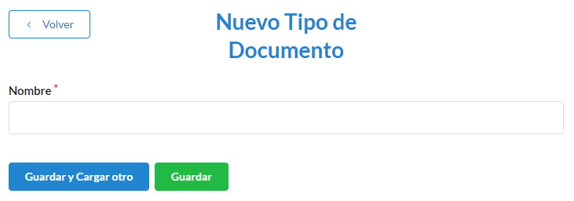
