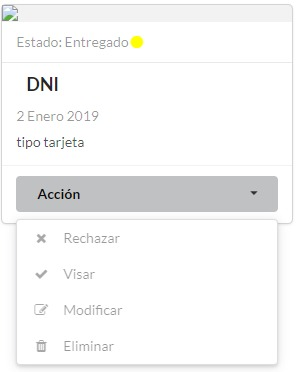
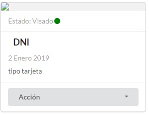

=========================
Cómo gestionar un permiso
=========================

Para poder continuar el proceso de aprobación de un permiso, desde el panel principal, podremos ingresar a la opción **Permisos**, donde visualizaremos el listado de permiso, localizamos el permiso.

.. image::  _static/solicitud_listado.png
   :align:  center

Nos dirigimos al icono inspeccionar, para ver en detalle el estado del permiso.

.. image::  _static/acion_inspecion.png
   :align:  center

.. image::  _static/permiso_informacion.png
   :align:  center

******************
Agregar Documentos
******************
Debemos completar toda la documentación faltante, que se especifica debajo de **Documentos faltantes:**, cuando contemos con alguna información faltante, debemos dirigirnos al botón **Agregar**.

.. image::  _static/solicitud_documento.png
   :align:  center

Para ingresar un documento, en la pantalla deberá completar los campos **Tipo** (para éste caso, aparecerá un desplegable con los documentos faltantes), **Descripción**, **Adjuntar el documento digital** (Se nos abrirá un explorador de archivos, en el cual debemos ubicar el archivo del documento a subir), **Fecha de entrega del documento** (Se registrará la fecha en que fue entregada la documentación). Completados los campos se podrá **Guardar**.

Completada toda la documentación requerida, nos encontraremos con éste mensaje. El visado es el trámite legal donde se corrobora que el documento presentado sea el correcto.

****************
Visar Documentos
****************

Para realizar el visado, debemos ir al botón de **Documentación**, y encontraremos el listado de los documentos presentados, con la descripción de el estado en que se encuentra cada uno.

.. image::  _static/solicitud_visado_documento.png
   :align:  center

El botón de **Acción** nos presentará un desplegable con las opciones disponibles:

**Rechazar** en caso de que el documento presente algún error.
**Visar** en caso de que el documento sea correcto.
**Modificar** en caso de que se necesite hacer un rectificación sobre el documento en cuanto a los datos cargados.
**Eliminar** en caso de error en la carga.

La acción de **Rechazar** es para cuando un documento no cumple con los requisitos o no sea válido. Ésta acción cambia el estado del permiso a **Revisado**.

.. image::  _static/solicitud_documento_accion_rechazar.jpeg
   :align:  center

La acción de **Visar** es para cuando el documento es correcto. Ésta acción puede cambiar el estado del permiso a **Visado**.

La acción de **Modificar** nos abrirá una nueva ventana, donde podremos modificar todos los datos. Ésta acción no cambia el estado del permiso.

.. image::  _static/solicitud_documento_accion_modificar.jpeg
   :align:  center

La acción de **Eliminar** es para cuando se desea borrar el documento presentado, nos preguntará si estamos seguros de realizar esta acción. Ésta acción no cambia el estado del permiso.

.. image::  _static/solicitud_documento_accion_eliminar.jpeg
   :align:  center

******************
Agregar Expediente
******************

Cuando la toda la documentación está cargada y visada, dentro del permiso nos encontaremos con un cartel **DOCUMENTACION COMPLETA** y un botón que nos pedirá que ingresemos el número de expediente.

.. image::  _static/solicitud_documento_completo.png
   :align:  center

Para terminar de ingregar el número de expediente, debemos completar **Descripción**, **Archivo**, **Fecha del documento**, **Número de expediente**

**************
Agregar Edicto
**************
Leugo de ingresado el expediente, se debe generar un edicto, el cual debe ser publicado dentro del boletín oficial y en al menos 1 diario local. 

.. image::  _static/agregar_edicto.png
   :align:  center

Debemos completar **Descripción**, **Archivo**, **Fecha del documento**, **Tiempo de publicación** (en días)

.. image::  _static/permiso_edicto.png
   :align:  center

Mientras estemos dentro de los días de publicación, puede que lleguen oposiciones o en caso de que no existan se realiza la resolución para otorgar el permiso. Tendremos la opción de **Agregar Resolución** o **Agregar Oposición**

******************
Agregar Resolución
******************

Debemos completar **Descripción**, **Archivo**, **Fecha del documento** (fecha de documento resolución), **Unidades** (cantidad de en la unidad de medida declarada en la resolución), **Fecha del primer cobro** (nos aclara la fecha máxima del cobro), **Fecha de vencimiento**.

.. image::  _static/permiso_resolucion.png
   :align:  center

Luego de agregada la resolución el **Permiso** se encuentra **Otorgado**

*****************
Agregar Oposición 
*****************

Debemos completar **Descripción**, **Archivo**, **Fecha del documento**.

.. image::  _static/permiso_oposicion.png
   :align:  center

***********************************
Como crear un nuevo establecimiento
***********************************

Para ingresar un nuevo establecimiento, en la pantalla deberá dirigirse a **Establecimientos**

.. image::  _static/panel_establecimiento.png
   :align:  center

Luego nos dirigimos a **Nuevo Establecimiento**

.. image::  _static/panel_establecimiento_nuevo.png
   :align:  center

En el formulario debemos completar los campos **Dueño** (este debe ser el solicitante), **Código catastral**, **Superficie** (esta sera tomadas en m2), **Nombre** (nombre del establecimiento), **Descripción**. Los campos con * son obligatorios. Completados los campos se podra **Guardar**.

.. image::  _static/nuevo_establecimiento.png
   :align:  center

*******************************
Como crear un nuevo tipo de uso
*******************************
Para ingresar un nuevo tipo de uso debemos ir a la opción **Tipo de Uso**

.. image::  _static/panel_tipodeuso.png
   :align:  center

Luego nos dirigimos a **Nuevo Tipo de Uso**

.. image::  _static/panel_tipodeuso_nuevo.png
   :align:  center

En el formulario debemos completar los campos **Descripción** (este sera el nombre del tipo de uso), **Coeficiente** (este puede ser un numero real), **Periodo** (para este caso, aparecera un desplegable con los periodos vigentes), **Medida** (para este caso, aparecera un desplegable con los periodos vigentes), **Tipo de modulo** (para este caso, aparecera un desplegable con los tipo de modulos vigentes), **Documentos requeridos** (para este caso, aparecera un desplegable con los documentos vigentes. Pueden tener mas de 1 documento asignado). Los campos con * son obligatorios. Completados los campos se podra **Guardar** o **Guardar y Cargar otro**.

.. image::  _static/nuevo_tipodeuso.png
   :align:  center

*************************************
Como crear un nuevo tipo de documento
*************************************
Para ingresar un nuevo tipo de documento debemos ir a **Tipos de Documentos**.

.. image::  _static/panel_tipodedocumento.png
   :align:  center

Luego nos dirigimos a **Nuevo Tipo de Documento**.

.. image::  _static/panel_tipodedocumento_nuevo.png
   :align:  center

En el formulario debemos completar los campos **Nombre**.

.. image::  _static/nuevo_tipodocumento.png
   :align:  center
