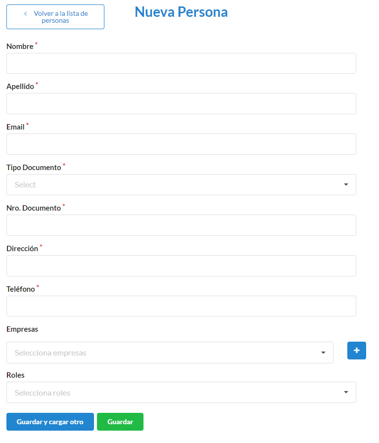
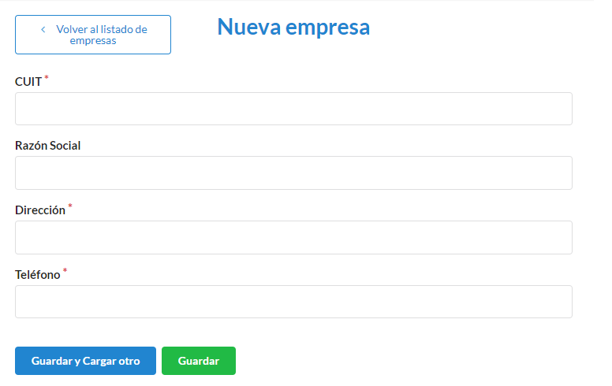

===========
Solicitante
===========

****************************
Comó crear una nueva persona
****************************

Para ingresar una nueva persona, en la pantalla deberá completar los campos **Nombre**, **Apellido**, **Email**, **Tipo de documento** (para este caso, aparecera un desplegable con los tipos vigentes), **Numero de documento**, **Dirección**, **Telefono**, **Empresa** (en caso de ser una **Empresa** se debera registrar, para esto debemos ir al **+** para poder agregarla), **Roles** (para este caso, aparecera un desplegable con los roles vigentes. Pueden tener mas de 1 rol asignado).Los campos con * son obligatorios. Completados los campos se podra **Guardar** o **Guardar y Cargar otro**.
   

****************************
Comó crear una nueva empresa
****************************

Para ingresar una nueva empresa, en la pantalla deberá completar los campos **CUIT**, **Razon social**, **Direccion**, **Telefono** .Los campos con * son obligatorios. Completados los campos se podra **Guardar** o **Guardar y Cargar otro**.

