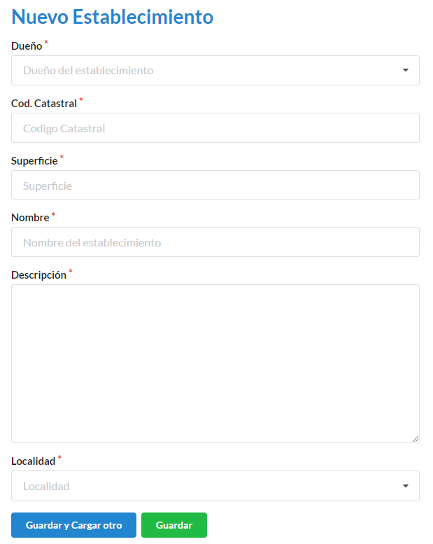

===========
Solicitante
===========

****************************
Comó crear una nueva persona
****************************

Para ingresar una nueva persona debemos ir a **Personas**

.. image::  _static/panel_personas.png
   :align:  center

Luego nos dirigimos a **Nueva persona**

.. image::  _static/panel_personas_nuevo.png
   :align:  center

En el formulario debemos completar los campos **Nombre**, **Apellido**, **Email**, **Tipo de documento** (para este caso, aparecera un desplegable con los tipos vigentes), **Numero de documento**, **Dirección**, **Telefono**, **Empresa** (en caso de ser una **Empresa** se debera registrar, para esto debemos ir al **+** para poder agregarla), **Roles** (para este caso, aparecera un desplegable con los roles vigentes. Pueden tener mas de 1 rol asignado).Los campos con * son obligatorios. Completados los campos se podra **Guardar** o **Guardar y Cargar otro**.
   
.. image::  _static/nueva_persona.png
   :align:  center

****************************
Comó crear una nueva empresa
****************************

Para ingresar una nueva empresa debemos ir a **Empresas**

Luego nos dirigimos a **Nueva persona**

En el formulario debemos completar los campos **CUIT**, **Razon social**, **Direccion**, **Telefono** .Los campos con * son obligatorios. Completados los campos se podra **Guardar** o **Guardar y Cargar otro**.

.. image::  _static/nueva_empresa.png
   :align:  center

***********************************
Comó crear un nuevo establecimiento
***********************************

Para ingresar un nuevo establecimiento debemos ir a **Establecimientos**

Luego nos dirigimos a **Nuevo Establecimiento**

.. image::  _static/panel_establecimiento_nuevo.png
   :align:  center

En el formulario debemos completar los campos **Dueño** (Debera ser una persona previamente cargada en el sistema), **Codgio catastral**, **Superficie**, **Nombre**, **Descripcion** .Los campos con * son obligatorios. Completados los campos se podra **Guardar** o **Guardar y Cargar otro**.

