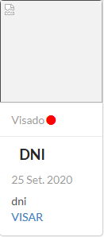
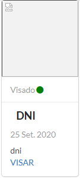

=======
Permiso
=======

***************************
Como crear un nuevo permiso
***************************
Desde el panel principal, podremos ingresar a **Permisos**.

.. image::  _static/panel_permiso.png
   :align:  center

Luego buscamos el boton de **Nuevo permiso**.

.. image::  _static/panel_permiso_nuevo.png
   :align:  center

Para ingresar un nuevo permiso, en la pantalla deberá completar los campos **Solicitante**, **Establecimiento**, **Tipo de uso de agua**, **Afluente**, **Fecha**, **Observacion**, **Utilizado** u **Oficio** (en caso de que se este utilizado el recurso, debe seleccionarse **Utilizado**, en caso de no estar siendo utilizado seleccionar **Oficio**). Los campos con * son obligatorios. Completados los campos se podra **Guardar** o **Guardar y Cargar otro**.

.. image::  _static/nueva_solicitud.png
   :align:  center

=========================
Como gestionar un permiso
=========================

Para poder continuar el proceso de aprobacion de un permiso, desde el panel principal, podremos ingresar a **Permisos**, donde visualizaremos el listado de permiso, localizamos el permiso.

.. image::  _static/solicitud_listado.png
   :align:  center

Nos dirigimos al icono inspeccionar, para ver en detalle el estado del permiso.

.. image::  _static/acion_inspecion.png
   :align:  center

.. image::  _static/permiso_informacion.png
   :align:  center

******************
Agregar Documentos
******************
Debemos completar toda la documentacion faltante, que se especifica debajo de **Documentación faltante**, cuando contemos con alguna informacion faltante, debemos dirigirnos al boton **Agregar**.

.. image::  _static/solicitud_documento.png
   :align:  center

Para ingresar un documento, en la pantalla deberá completar los campos **Tipo** (para este caso, aparecera un desplegable con los documentos faltantes), **Descripcion**, **Archivo** (Se nos abrira un explorador de archivos, el cual debemos ubicar el archivo del documento a subir), **Fecha del documento** (Se registrara la fecha en que fue entregada la documentación)

Completada toda la documentacion requerida, nos encontraremos con este mensaje. El visado es el tramite legal donde se corrobora que el documento presentado sea el correcto.

.. image::  _static/solicitud_visado.png
   :align:  center

****************
Visar Documentos
****************

Para realizar el visado, debemos ir al boton de **acción** y dirigirnos a **Ve Documentación Presentada**.

.. image::  _static/solicitud_visado_documento.png
   :align:  center

Los documentos que tienen un **Circulo color rojo** que nos indicaran que aun faltan visar, para poder cambiar la condicion a **Visado**, debemos precionar el botor **Visar**.

Los documentos ya visados aparecentan con un **Circulo color verde**

******************
Agregar Expediente
******************

Cuando la toda la documentacion esta cargada y visada, dentro del persmiso nos encontaremos con un cartel **DOCUMENTACION COMPLETA** y un boton que nos pedira que ingresemos el numero de expediente. (Este numero sera otorgado por **QUIEN LO OTORGA????????**)

.. image::  _static/solicitud_documento_completo.png
   :align:  center

Para terminar de ingregar el numero de expediente, debemos completar **Descripcion**, **Archivo**, **Fecha del documento**, **Numero de expediente**

.. image::  _static/solicitud_expediente.png
   :align:  center

**************
Agregar Edicto
**************
Leugo de ingresado el expediente, se debe generar un edicto, el cual debe ser publicado dentro del boletin oficial y en al menos 1 diario local. 

.. image::  _static/agregar_edicto.png
   :align:  center

Debemos completar **Descripcion**, **Archivo**, **Fecha del documento**, **Tiempo de publicacion** (en dias)

.. image::  _static/permiso_edicto.png
   :align:  center

Mientras estemos dentro de los dias de publicacion, puede que lleguen oposiciones o en caso de que no existan se realiza la resolucion para otorgar el permiso. Tendremos la opcion de **Agregar Resolucion** o **Agregar Oposicion**

.. image::  _static/agregar_resolucion.png
   :align:  center

******************
Agregar Resolucion
******************

Debemos completar **Descripcion**, **Archivo**, **Fecha del documento**, **Unidades**, **Fecha del primer cobro** (nos aclara la fecha maxima del cobro), **Fecha de venciminto**.

.. image::  _static/permiso_resolucion.png
   :align:  center

Luego de agregada la resolucion el **Permiso** se encuentra **Otorgado**

*****************
Agregar Oposicion 
*****************

Debemos completar **Descripcion**, **Archivo**, **Fecha del documento**.

.. image::  _static/permiso_oposicion.png
   :align:  center

***********************************
Como crear un nuevo establecimiento
***********************************

Para ingresar un nuevo establecimiento, en la pantalla deberá dirigirse a **Establecimientos**

.. image::  _static/panel_establecimiento.png
   :align:  center

Luego nos dirigimos a **Nuevo Establecimiento**

.. image::  _static/panel_establecimiento_nuevo.png
   :align:  center

En el formulario debemos completar los campos **Dueño** (este debe ser el solicitante), **Codigo catastral**, **Superficie** (esta sera tomadas en m2), **Nombre** (nombre del establecimiento), **Descripción**. Los campos con * son obligatorios. Completados los campos se podra **Guardar** o **Guardar y Cargar otro**.

.. image::  _static/nuevo_establecimiento.png
   :align:  center

*******************************
Como crear un nuevo tipo de uso
*******************************
Para ingresar un nuevo tipo de uso debemos ir a **Tipo de Uso**

.. image::  _static/panel_tipodeuso.png
   :align:  center

Luego nos dirigimos a **Nuevo Tipo de Uso**

.. image::  _static/panel_tipodeuso_nuevo.png
   :align:  center

En el formulario debemos completar los campos **Descripción** (este sera el nombre del tipo de uso), **Coeficiente** (este puede ser un numero real), **Periodo** (para este caso, aparecera un desplegable con los periodos vigentes), **Medida** (para este caso, aparecera un desplegable con los periodos vigentes), **Tipo de modulo** (para este caso, aparecera un desplegable con los tipo de modulos vigentes), **Documentos requeridos** (para este caso, aparecera un desplegable con los documentos vigentes. Pueden tener mas de 1 documento asignado). Los campos con * son obligatorios. Completados los campos se podra **Guardar** o **Guardar y Cargar otro**.

.. image::  _static/nuevo_tipodeuso.png
   :align:  center

*************************************
Como crear un nuevo tipo de documento
*************************************
Para ingresar un nuevo tipo de documento debemos ir a **Tipos de Documentos**.

.. image::  _static/panel_tipodedocumento.png
   :align:  center

Luego nos dirigimos a **Nuevo Tipo de Documento**.

.. image::  _static/panel_tipodedocumento_nuevo.png
   :align:  center

En el formulario debemos completar los campos **Nombre**.

.. image::  _static/nuevo_tipodocumento.png
   :align:  center

******************************
Como crear una nueva localidad
******************************

***************************
Como crear una nueva ciudad
***************************